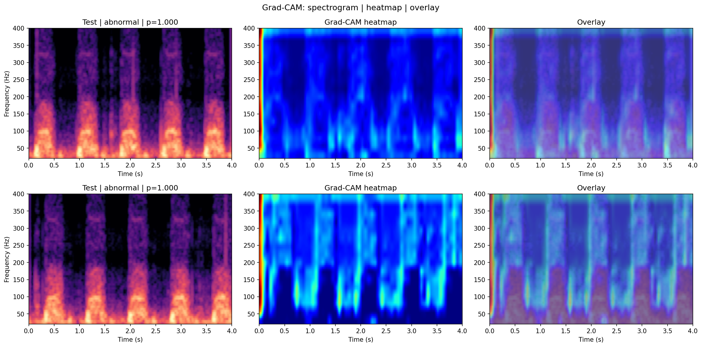
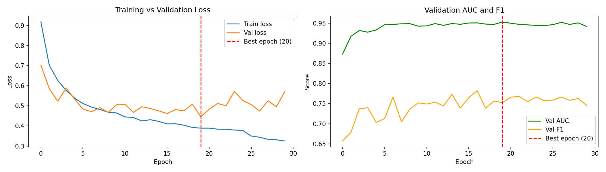

# Heart Disease Detection using Phonocardiogram (PCG)

A low-cost, real-time cardiac screening system that detects heart disease from phonocardiogram (PCG) recordings using a CNN-BiLSTM deep learning model with Grad-CAM explainability, trained and validated across two independent public datasets.

## Key Results

| Metric | Value |
|--------|-------|
| Test AUC | **0.9584** |
| Sensitivity (at optimal threshold) | **83%** |
| Specificity | **93%** |
| Optimal threshold | **0.532**
| Cross-dataset AUC gap (PhysioNet vs CirCor) | 0.0065 |
| Min. usable SNR (AUC ≥ 0.85) | 15 dB |

> **Note:** verify these against your latest `results.json` before publishing — earlier internal runs reported different sensitivity/specificity at a different decision threshold.

## Results Preview



*Grad-CAM overlay showing model attention on an abnormal PCG recording. Red/yellow regions indicate diagnostically significant time-frequency areas.*



## Datasets

- [PhysioNet/CinC Challenge 2016](https://physionet.org/content/challenge-2016/1.0.0/)
- [CirCor DigiScope 2022](https://physionet.org/content/circor-heart-sound/1.0.3/)

## Architecture

```
PCG (.wav) → Preprocessing → Log-mel Spectrogram → CNN Encoder
→ BiLSTM → Attention Pooling → Binary Classifier
                                      ↓
                        Grad-CAM explainability overlay
```

- **CNN Encoder:** 3 blocks (1→32→64→128 channels), 3×3 kernels
- **BiLSTM:** 2 layers, hidden size 64, bidirectional
- **Attention:** learnable soft-attention pooling across time steps
- **Classifier:** 2-layer MLP (128→64→1)
- **~351K parameters total**

## Project Structure

```
pcg-project/
├── app/
│   └── dashboard.py       # Streamlit demo dashboard
├── src/                   # Production package
│   ├── model.py           # PCGClassifier architecture
│   ├── dataset.py         # PCGDataset with SpecAugment
│   ├── train.py           # Training loop (early stopping, scheduler)
│   ├── inference.py       # PCGPredictor for single/batch inference
│   └── preprocessing.py   # Signal preprocessing utilities
├── tests/                 # Unit tests (29 passing)
├── notebooks/             # Research notebooks (Phases 1-11)
├── results/               # Evaluation plots and tables
├── models/                # Trained model weights + config
├── config.yaml            # Training configuration
├── train_cli.py           # CLI entry point for training
└── requirements.txt
```

## Quick Start

### Installation

```bash
git clone https://github.com/PrinceeSingh/Heart-Disease-Detection-using-PCG.git
cd Heart-Disease-Detection-using-PCG
pip install -r requirements.txt
```

### Run the Demo Dashboard

```bash
streamlit run app/dashboard.py
```

Upload any `.wav` PCG recording to get a prediction with a Grad-CAM explanation.

### Train from Scratch

```bash
python train_cli.py \
  --features ./data/features/logmel.npy \
  --labels ./data/features/labels.npy \
  --train-idx ./data/features/train_idx.npy \
  --val-idx ./data/features/val_idx.npy \
  --test-idx ./data/features/test_idx.npy \
  --output ./models \
  --epochs 40 \
  --batch-size 64 \
  --lr 1e-3 \
  --device cuda
```

Outputs `best_model.pt` (highest validation AUC checkpoint) and `results.json` (test metrics + training history) to `--output`.

### Run Inference

```python
from src.inference import PCGPredictor
import numpy as np

predictor = PCGPredictor('./models/best_model.pt', threshold=0.758)

spectrogram = np.random.randn(64, 251)  # log-mel spectrogram
pred, prob = predictor.predict(spectrogram, return_probabilities=True)
print(f"Prediction: {'Abnormal' if pred == 1 else 'Normal'} ({prob:.2%})")
```

### Run Tests

```bash
pytest tests/ -v
```

29 tests covering model correctness (shapes, gradients, attention weights), dataset behavior (augmentation, edge cases), inference (single/batch prediction, thresholding), and the LR scheduler — all passing.

## Pipeline Phases

| Phase | Description |
|-------|-------------|
| 1 | Data acquisition (PhysioNet 2016 + CirCor 2022) |
| 2 | Exploration & unified manifest |
| 3 | Preprocessing (bandpass, despike, wavelet denoise) |
| 4 | Segmentation into 4-second windows |
| 5 | Log-mel spectrogram feature extraction |
| 6 | Group-aware (patient-level) train/val/test split |
| 7 | CNN-BiLSTM model training |
| 8 | Test set evaluation |
| 9 | Grad-CAM explainability |
| 10 | Streamlit dashboard |
| 11 | Noise robustness stress test |

## Roadmap

- [ ] Ablation studies (remove BiLSTM, attention, SpecAugment individually)
- [ ] Hyperparameter search (Optuna/Ray Tune)
- [ ] Error analysis on false negatives
- [ ] Per-dataset performance breakdown (PhysioNet vs CirCor)
- [ ] Model quantization (int8) for on-device/IoT deployment
- [ ] Uncertainty quantification (Monte Carlo Dropout)

## Disclaimer

Research prototype only. Not a certified medical device. Results must not be used for clinical diagnosis.
